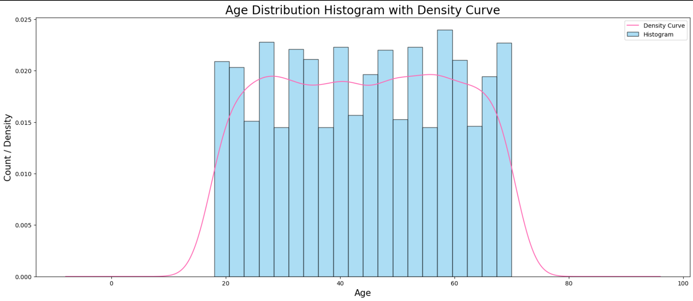
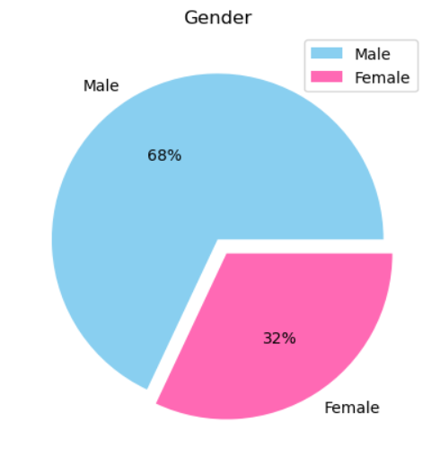
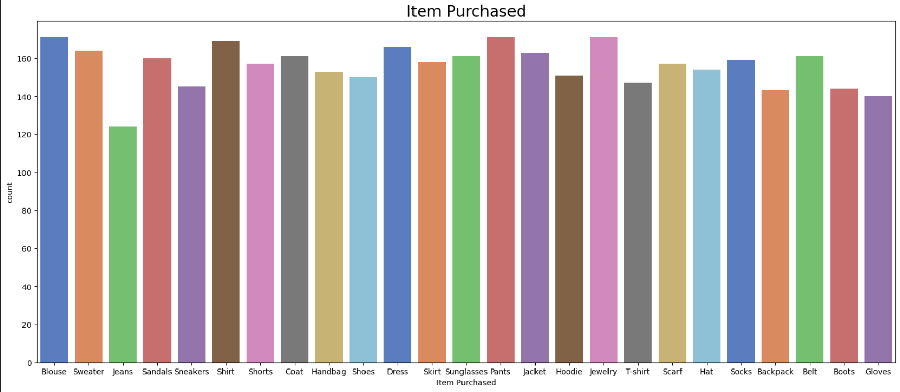
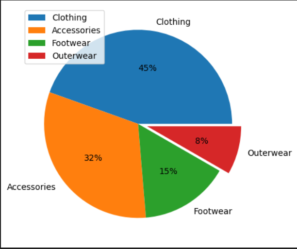
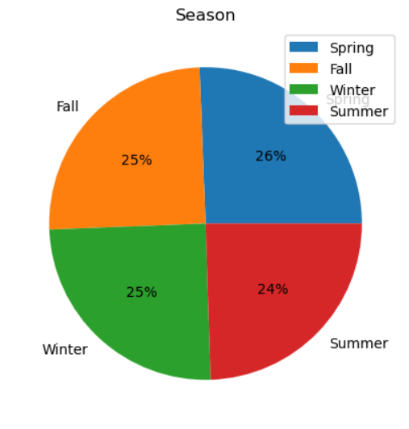
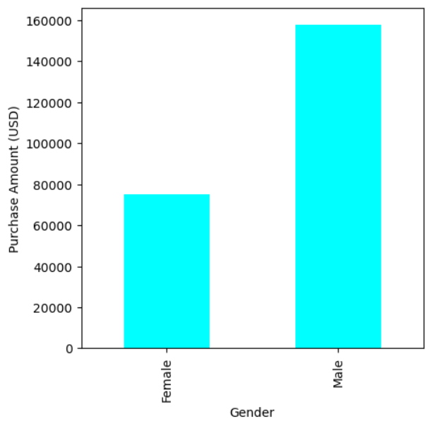
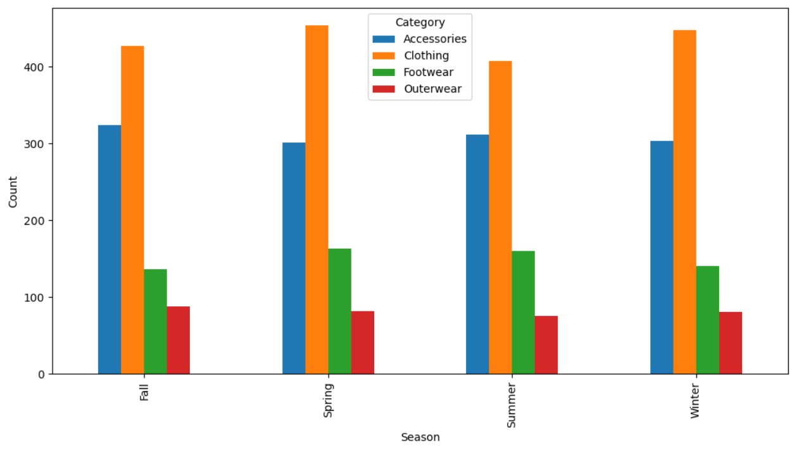

# Shopping Trends Analysis

Shopping Trends Analysis is an Exploratory Data Analysis project focused on understanding customer purchasing behavior, product preferences, seasonal shopping patterns, and the impact of discounts on sales.

The project uses a shopping trends dataset containing customer demographics, purchase details, product categories, payment methods, discounts, and seasonal attributes. The analysis helps identify useful business insights for marketing, inventory planning, and customer targeting.

---

## Project Overview

Retail businesses often face challenges in understanding customer behavior, product demand, seasonal preferences, and the effectiveness of discounts or promotions.

This project performs Exploratory Data Analysis on shopping transaction data to uncover patterns in customer purchases, demographics, seasonal trends, product categories, and discount usage.

The main goal is to provide actionable insights that can help businesses improve decision-making in marketing, inventory management, and customer engagement.

---

## Problem Statement

Retail businesses need to understand the factors that influence customer purchasing behavior. Customer age, gender, season, product category, discount usage, and payment methods can all affect shopping patterns.

This project analyzes shopping trend data to identify key patterns and relationships that can support better business strategies.

---

## Objectives

- Analyze customer demographics such as age and gender
- Identify popular product categories and frequently purchased items
- Study seasonal shopping patterns
- Understand the impact of discounts and promotions
- Compare purchase behavior across gender and product categories
- Visualize important shopping trends using charts
- Provide insights for marketing and inventory planning

---

## Dataset

The dataset used in this project is:

```text
shopping_trends.csv
```

The dataset contains shopping transaction records with features such as:

- Customer ID
- Age
- Gender
- Item Purchased
- Category
- Purchase Amount
- Location
- Size
- Color
- Season
- Review Rating
- Subscription Status
- Payment Method
- Shipping Type
- Discount Applied
- Promo Code Used
- Previous Purchases
- Preferred Payment Method
- Frequency of Purchases

---

## Tools and Libraries Used

- Python
- Jupyter Notebook
- Pandas
- NumPy
- Matplotlib
- Seaborn
- Plotly

---

## Project Structure

```text
Shopping-Trends-Analysis/
│
├── README.md
├── requirements.txt
├── .gitignore
│
├── data/
│   ├── README.md
│   └── shopping_trends.csv
│
├── notebooks/
│   ├── README.md
│   └── shopping_trends_analysis.ipynb
│
├── reports/
│   ├── README.md
│   ├── final_report.pdf
│   └── shopping_trends_presentation.pptx
│
└── images/
    ├── README.md
    ├── age_distribution.png
    ├── gender_distribution.png
    ├── item_purchased_countplot.png
    ├── category_distribution.png
    ├── season_distribution.png
    ├── gender_purchase_amount.png
    └── season_category_analysis.png
```

---

## Analysis Performed

### 1. Data Loading

The dataset was loaded using Pandas for analysis.

### 2. Data Cleaning

The dataset was checked for:

- Missing values
- Duplicate records
- Data consistency
- Categorical and numerical variables

### 3. Exploratory Data Analysis

The analysis includes:

- Age distribution
- Gender distribution
- Item purchased analysis
- Product category analysis
- Seasonal shopping analysis
- Gender-wise purchase amount analysis
- Season and category relationship analysis

### 4. Data Visualization

Charts were created using Matplotlib and Seaborn to understand patterns in the dataset.

---

## Key Visualizations

### Age Distribution

This histogram shows the distribution of customer ages and helps identify the major age groups present in the shopping dataset.



### Gender Distribution

This pie chart shows the percentage distribution of male and female customers in the dataset.



### Item Purchased Count Plot

This count plot shows the frequency of different items purchased by customers and helps identify popular products.



### Category Distribution

This pie chart shows the distribution of purchases across product categories such as Clothing, Accessories, Footwear, and Outerwear.



### Season Distribution

This pie chart shows how shopping activity is distributed across different seasons.



### Gender vs Purchase Amount

This bar chart compares the total purchase amount between male and female customers.



### Season and Category Analysis

This grouped bar chart shows the relationship between seasons and product categories.



---

## Key Insights

- Clothing is one of the most purchased product categories.
- Seasonal trends influence customer purchase behavior.
- Gender and age show noticeable differences in shopping patterns.
- Discounts and promotional offers can influence customer purchases.
- Product category demand varies across different seasons.
- Visual analysis helps businesses identify customer preferences and demand patterns.

---

## How to Run Locally

### 1. Clone the repository

```bash
git clone https://github.com/Althafk7171/Shopping-Trends-Analysis.git
cd Shopping-Trends-Analysis
```

### 2. Install required libraries

```bash
pip install -r requirements.txt
```

### 3. Open Jupyter Notebook

```bash
jupyter notebook
```

### 4. Run the notebook

Open:

```text
notebooks/shopping_trends_analysis.ipynb
```

Run all cells to reproduce the analysis.

---

## Results

The analysis provides useful insights into customer shopping behavior, product preferences, seasonal trends, and purchase patterns.

These insights can help businesses:

- Improve inventory planning
- Design better marketing campaigns
- Understand customer preferences
- Optimize discount and promotional strategies
- Identify high-demand product categories

---

## Reports

This repository includes:

- Final project report
- Project presentation
- Jupyter Notebook analysis
- Dataset
- Visualization images

---

## Limitations

- The analysis is based on historical shopping data.
- The project focuses on exploratory analysis and does not include predictive modeling.
- Customer feedback and real-time transaction data are not included.
- The dataset may not represent all types of retail businesses.

---

## Future Scope

- Build predictive models for sales forecasting
- Apply customer segmentation using clustering
- Create an interactive dashboard using Power BI, Tableau, or Streamlit
- Analyze customer lifetime value
- Include real-time transaction data
- Study the effect of promotions in more detail

---

## Contributor

- Muhammed Althaf K

---

## License

This project is developed for academic and learning purposes.

---

## Repository Topics

Recommended GitHub topics:

```text
data-analysis
exploratory-data-analysis
shopping-trends
customer-behavior
retail-analytics
python
pandas
matplotlib
seaborn
plotly
jupyter-notebook
data-visualization
```
